**Digits**

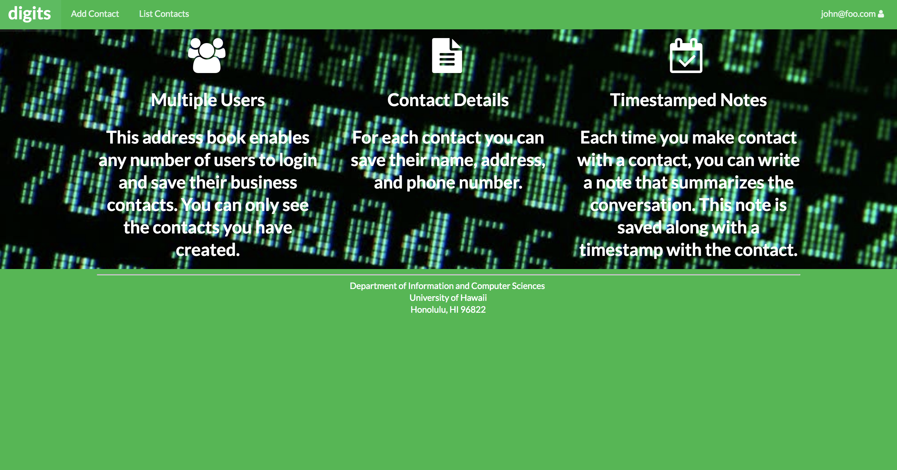

Digits is an application that allows users to: 

- Register an account 
- Create and manage the contacts
- Add a set of timestamped notes regarding their interaction with each contact.

Installation

First, [install meteor](https://www.meteor.com/install)

Second, [download a copy of digits](https://github.com/sethak/digits)

Third, cd into the app directory and install required libraries

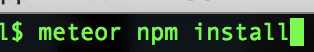

Once libraries are installed, run the application 

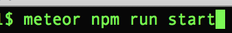

The first time you run the app, it creates default users and data. Out put is right here:

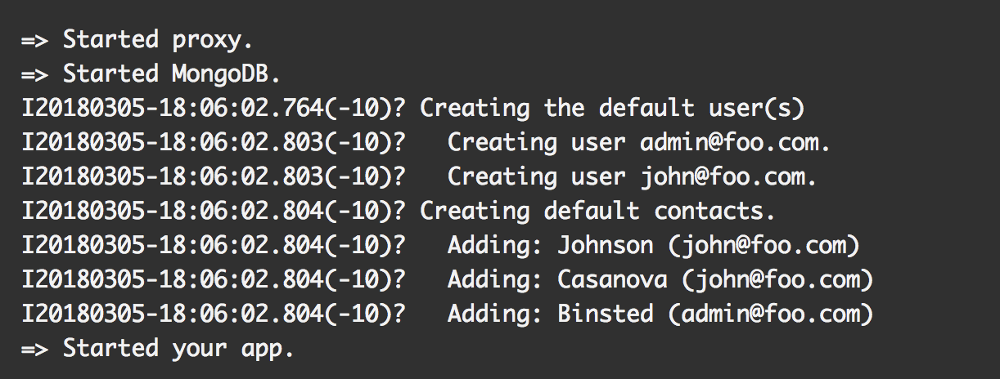

You will also get this bcrypt warning as well. 

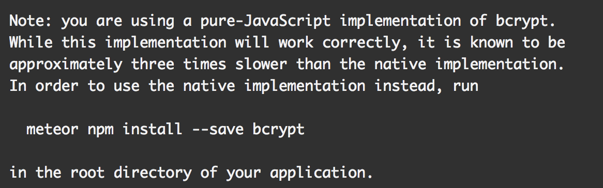

You do not need to worry about this, your application will still run fine. It will appear at [http://localhost:3000](http://localhost:3000/). 

Lastly, run ESlint over the imports/directory with: 

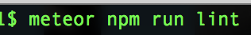

**User Interface Walkthrough**

Landing Page:

When you first bring up the application, you should get to this page. It provides a brief introduction to the capabilities of digits. 

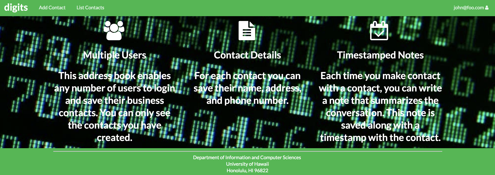

Register:
If you do not yet have an account on the system, you can register by clicking on “Login”, then “Sign Up”:

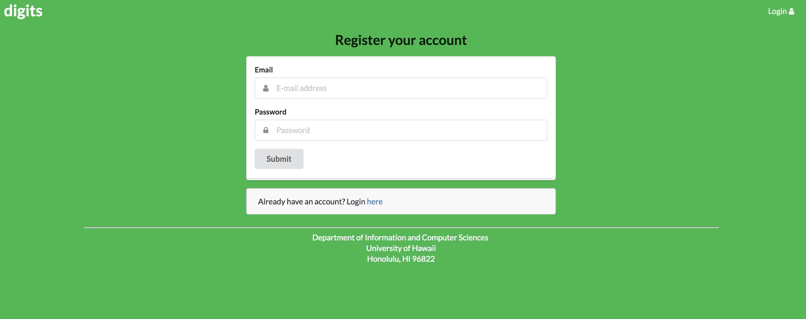

Sign in:

Click on the Login link, then click on the Signin link to bring up the Sign In page which allows you to login:

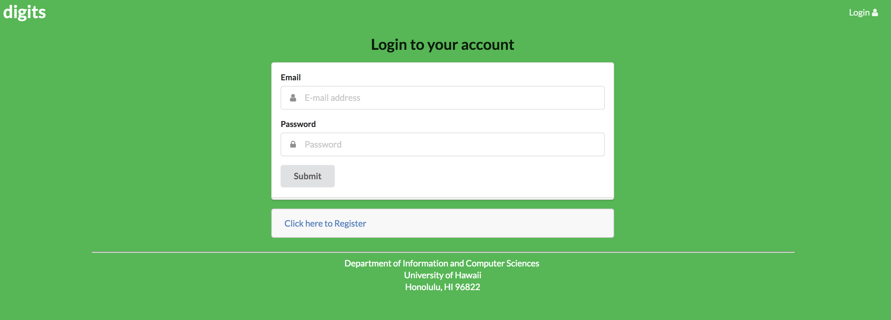

User home page

After logging on successfully, it looks like the landing page, but the NavBar contains links to list contact and add new contacts:

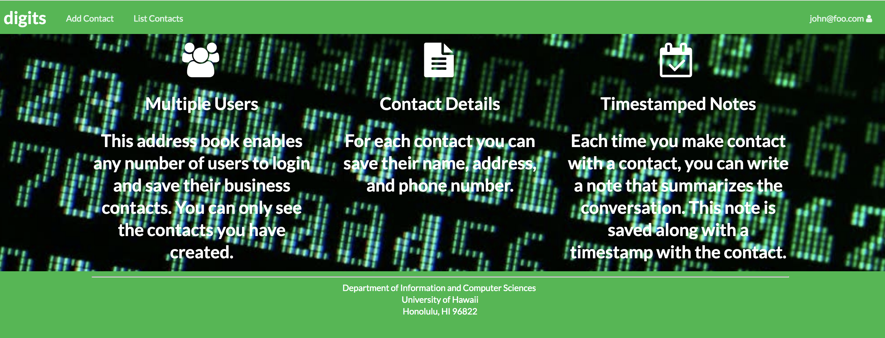

List Contacts:

Clicking on the List Contacts link brings you to a page where all the contacts are listed for the user that is logged in. You can also see how a note is added in the image. You can post interactions you've had with the client in this timestamped "notes" section. 
 
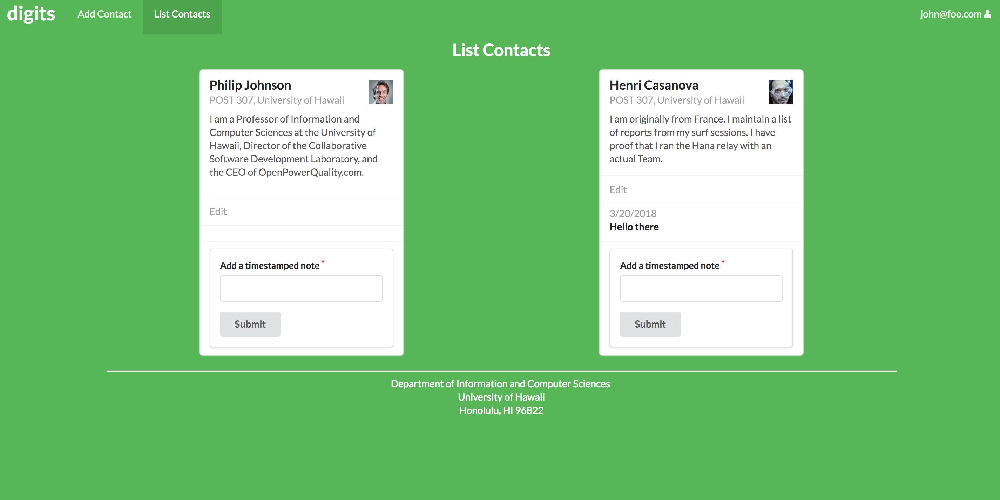

Edit Contacts: 

From the List Contacts page, the user can edit the contact information

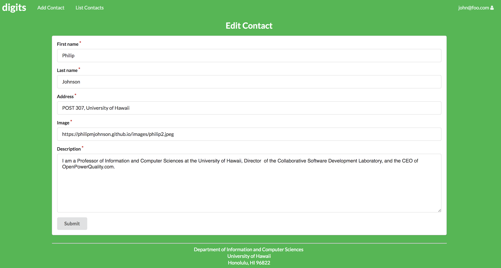

Admin mode:

It is possible to designate one or more users as “Admins” through the settings file. When a user has the Admin role, they get access to a special NavBar link that retrieves a page listing all Contacts associated with all users:

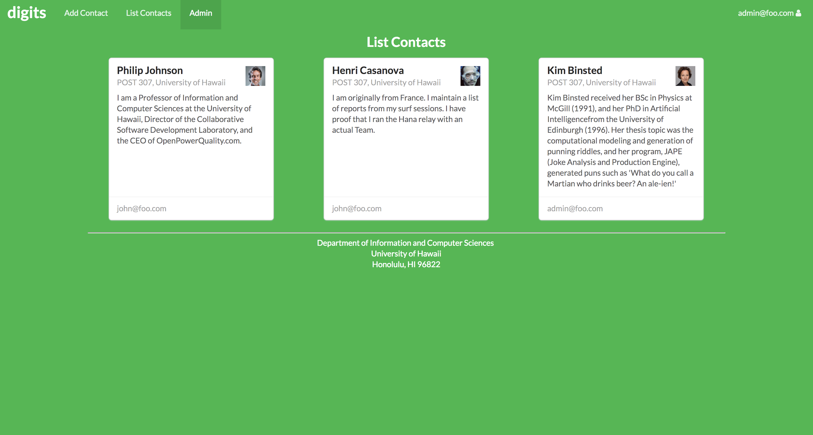

